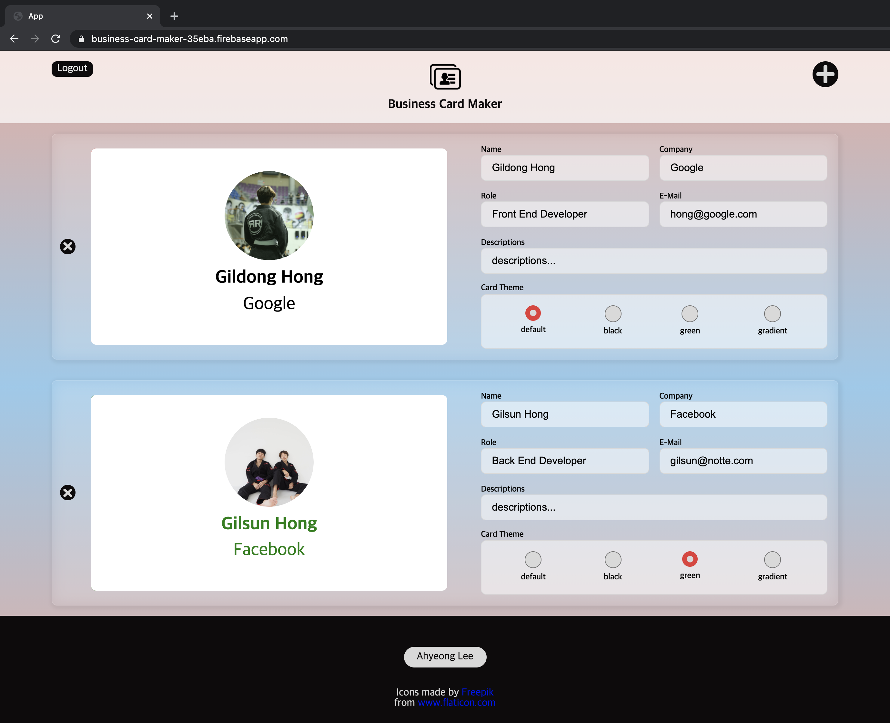
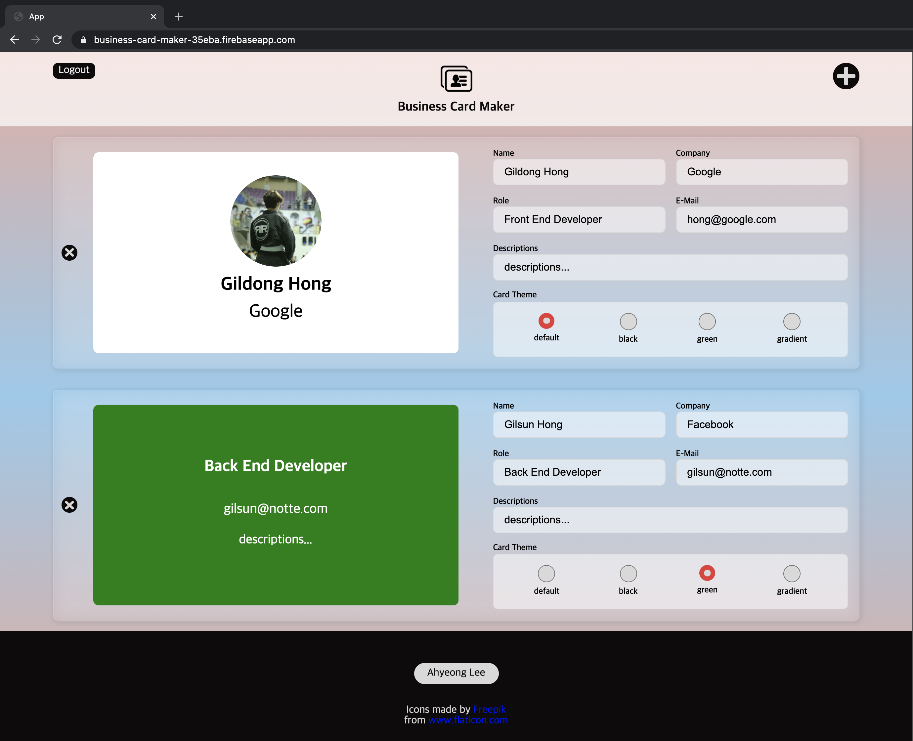
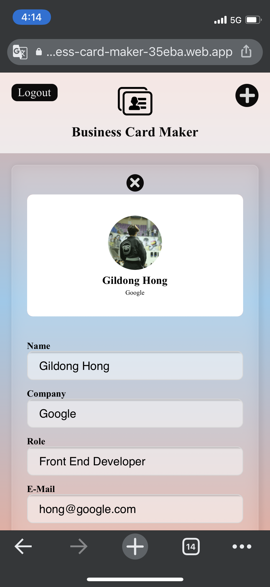

# Business Card Maker

<br>
이름, 회사 등 정보를 입력하면 명함 형태로 보여주는 반응형 웹 애플리케이션

(요금 때문에 현재는 사이트를 닫아 놓은 상태)
<br></br>
<br>
<br>

<br><br>

<details open="open">
  <summary>개요</summary>
  <ol>
    <li><a href="#about-the-project">About The Project</a></li>
    <li><a href="#skills">Skills</a></li>
    <li><a href="#screen-shots">Screen Shots</a></li>
    <li><a href="#acknowledgements">Acknowledgements</a></li>
    <li><a href="#what-i-learned">What I Learned</a></li>
  </ol>
</details>
</br>

---

</br>

## About The Project

드림코딩 아카데미 React Basic 강의 마지막 과제.
React Hooks, PostCSS, React Router, Firebase 그리고 Cloudinary, 이렇게 강의에서 주어진 5가지 키워드와 데모를 보고 Solution 듣기 전에 개발.

디자인, 애니메이션 효과는 내 마음대로 👻

## Skills

- React JS
- Html/CSS

## Screen Shots

- Desktop</br>
  <br>
  <small>명함 클릭하면 뒷면 볼 수 있음 </small><br>
  
  <br>
- Mobile</br>
  

## Functions

- Sign in with Auth Provider
- Add, Delete Card
- Write, Read, Update and Delete data in realtime
- Upload image (drag & drop 으로도 가능)

## APIs

- [Firebase](https://firebase.google.com/?hl=pt-br)
  - Hosting, Realtime Database, Authentication
- [Cloudinary](https://cloudinary.com/)

## Acknowledgements

- [Font Awesome](https://fontawesome.com/)
- [Dream Coding](https://academy.dream-coding.com/)

## What I Learned

#### Flex box ios Bug

```css
// flex container
flex-direction: column;
```

  <small>

- PC에서 볼 때는 자식 element 들의 크기에 따라 유연하게 크기가 결정 되었지만 배포 후 ios에서 봤을 때 아래와 같이 버그가 있었음
- flex를 column 정렬했을 때 flexable한 요소들이 모두 shrink 되었음
- header는 flex-basis를 정해줬기 때문에 줄어들지 않음

  </small>

</br>

#### Flex box ios Bug Fix

```css
// flex items
flex-shrink: 0;
```

```css
// flex items
flex-basis: 100px;
```

  <small>

- flex item 들의 자리가 부족해서 알아서 shrink 된 것이 버그의 원인
- flex-shrink 를 0으로 적용시켜 shrink 되지 않도록 함
- flex-basis 를 사용하면 크기가 고정되는데 이것은 내가 원하는 것이 아님 (자식 element의 크기에 따라서 자연스럽게 반응하기를 원했음)
- header는 flex-basis 를 정해줌

  </small>
