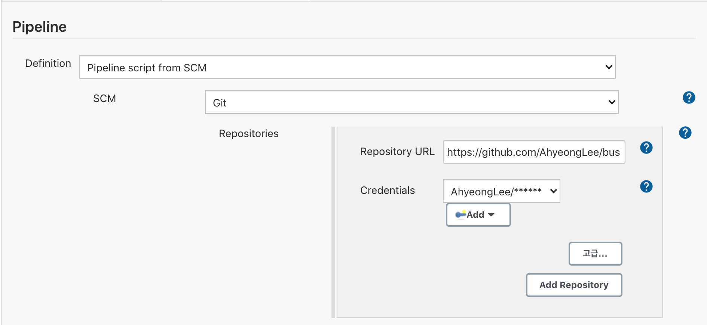
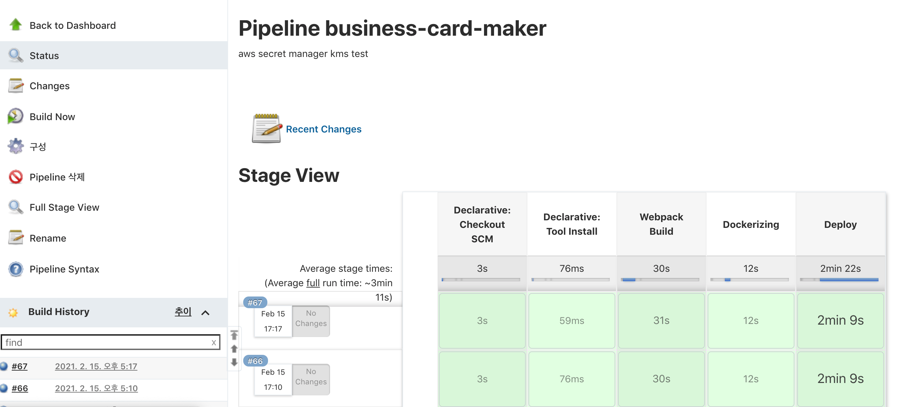
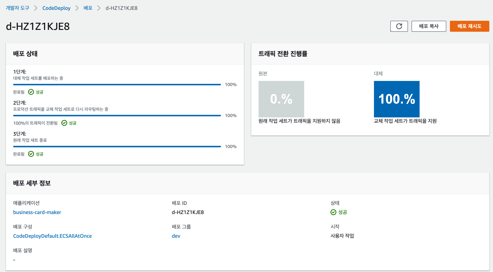

# Business Card Maker

<br>
이름, 회사 등 정보를 입력하면 명함 형태로 보여주는 반응형 웹 애플리케이션

바로가기: [Business Card Maker](https://aylee.shop)
<br></br>
<br>
<br>

<br><br>

<details open="open">
  <summary>개요</summary>
  <ol>
    <li><a href="#about-the-project">About The Project</a></li>
    <li><a href="#skills">Skills</a></li>
    <li><a href="#screen-shots">Screen Shots</a></li>
    <li><a href="#functions">Functions</a></li>
    <li><a href="#cicd">CICD</a></li>
    <li><a href="#acknowledgements">Acknowledgements</a></li>
    <li><a href="#what-i-learned">What I Learned</a></li>
  </ol>
</details>
</br>

---

</br>

## About The Project
드림코딩 아카데미 React Basic 강의 마지막 과제.<br>
`React` 라이브러리를 사용해서 개발했고 `webpack`과 `babel`을 세팅해서 빌드하고<br>
`Jenkins`와 `CodeDeploy`를 이용하여 `AWS ECS`에 배포.


## Skills

- React JS
- React Router
- Webpack
- Babel
- PostCSS
- Firebase(Realtime Database, Authentication)
- Cloudinary
- AWS(ECS, CodeDeploy)
- Docker

## Screen Shots

- Desktop</br>
  <br>
  <small>명함 클릭하면 뒷면 볼 수 있음 </small><br>
  
  <br>
- Mobile</br>
  

## Functions

- Sign in with Auth Provider
- Add, Delete Card
- Write, Read, Update and Delete data in realtime
- Upload image (drag & drop 으로도 가능)

## CICD
- Github
- Jenkins
  ### Jenkinsfile from Git
  <br>

  ### Jenkins Pipeline

  <br>
  ```
  stages {
    stage('Webpack Build') {
      - npm install
      - webpack build
    }
    stage('Dockerizing') {
      - copy public, dist folder to server/
      - docker image build & push to AWS ECR
      - update ecs task definition
    }
    stage('Deploy') {
      - craete appspec.yml & upload to s3
      - create deployment(AWS CodeDeploy)
      - wait while the deployment is complete
    }
  }
  ```
- AWS CodeDeploy

  <br>

## Acknowledgements

- [Font Awesome](https://fontawesome.com/)
- [Dream Coding](https://academy.dream-coding.com/)

## What I Learned

#### Flex box ios Bug

```css
// flex container
flex-direction: column;
```

  <small>

- PC에서 볼 때는 자식 element 들의 크기에 따라 유연하게 크기가 결정 되었지만 배포 후 ios에서 봤을 때 아래와 같이 버그가 있었음
- flex를 column 정렬했을 때 flexable한 요소들이 모두 shrink 되었음
- header는 flex-basis를 정해줬기 때문에 줄어들지 않음

  </small>

</br>

#### Flex box ios Bug Fix

```css
// flex items
flex-shrink: 0;
```

```css
// flex items
flex-basis: 100px;
```

  <small>

- flex item 들의 자리가 부족해서 알아서 shrink 된 것이 버그의 원인
- flex-shrink 를 0으로 적용시켜 shrink 되지 않도록 함
- flex-basis 를 사용하면 크기가 고정되는데 이것은 내가 원하는 것이 아님 (자식 element의 크기에 따라서 자연스럽게 반응하기를 원했음)
- header는 flex-basis 를 정해줌

  </small>
